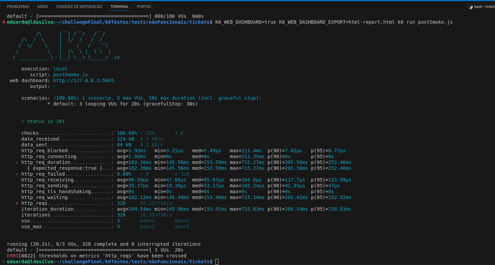
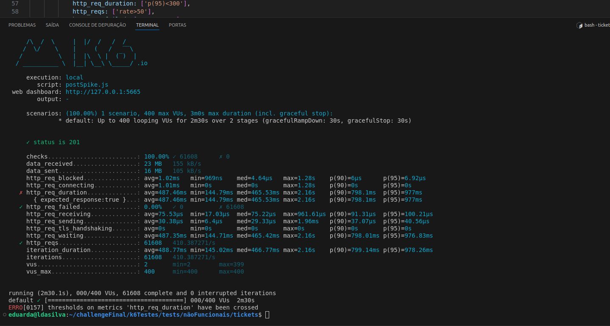
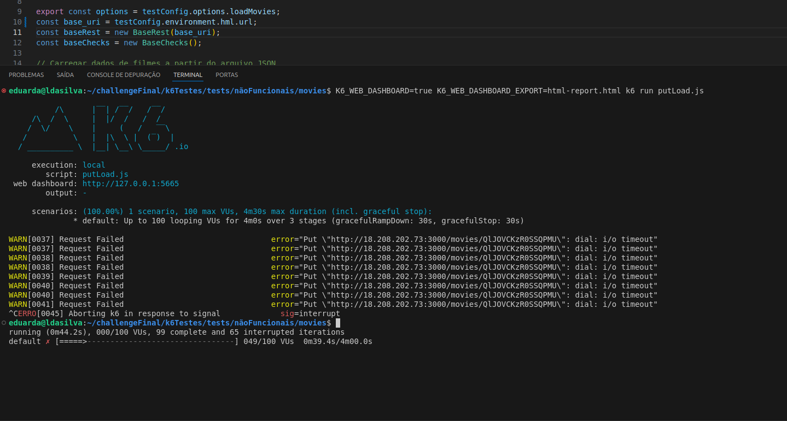
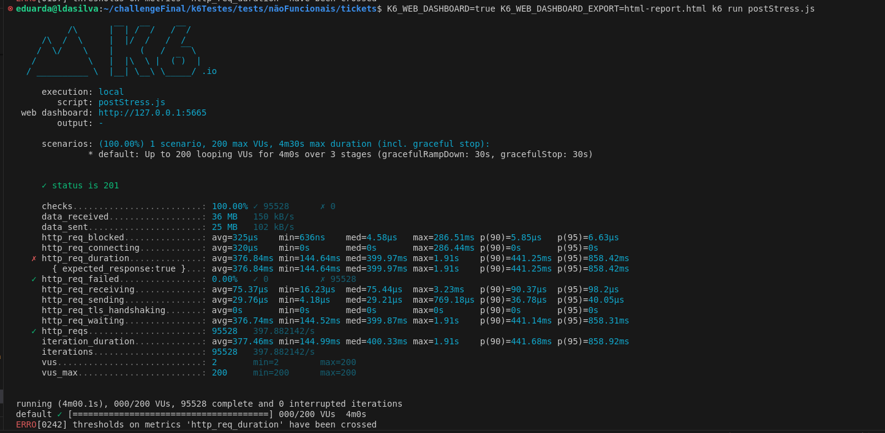

## Matriz de Resultados dos Testes Não Funcionais

- Na rota `tickets`, foram realizados somente testes que abrangem os verbos GET e POST, já que os restantes falharam nos testes funcionais.
- O fluxo foi pensado para abranger somente os verbos que funcionaram nos testes funcionais.

---

### Smoke (Teste de Fumaça) - CP1

| **Teste**        | **Descrição**                           | **REQUISITOS**                                  | **CHECKS**                                    | **Status** | **Objetivo** | **Relatório**                          |
|------------------|-----------------------------------------|------------------------------------------------|----------------------------------------------|------------|--------------|----------------------------------------|
| CP1.1            | GET/movies/{id}                         | Status code 200                                | checkStatusCode                              | ✅         | A API deve ser capaz de responder a solicitações GET de detalhes de um filme em menos de 50 milissegundos.  | [reportGetIdSmoke.pdf](https://github.com/eduardaldasilva/challengeFinal/blob/main/challengeDocs/reportsNaoFuncionais/movies/reportGetIdSmoke.pdf) |
| CP1.2            | GET/tickets                             | Status code 200                                | checkStatusCode                              | ✅         | A API deve ser capaz de responder a solicitações GET de listagem de tickets em menos de 100 milissegundos      | [reportGetSmoke.pdf](https://github.com/eduardaldasilva/challengeFinal/blob/main/challengeDocs/reportsNaoFuncionais/tickets/reportGetSmoke.pdf) |
| CP1.3            | POST/tickets                            | Status code 201                                | checkStatusCode                              | ❌         | A API deve ser capaz de processar pelo menos 50 solicitações de reserva de ingressos por segundo. O tempo médio de resposta para a reserva de um ingresso não deve exceder 300 milissegundos       |  |
| Fluxo Completo   | POST/movies, GET/movies, GET/movies/{id}, PUT/movies/{id}, POST/tickets, GET/tickets, DELETE/movies/{id} | Status code 200 para GET, 201 para POST e PUT, 200 para DELETE | checkStatusCode                              | ❌         | Não passou         | [reportFluxoSmoke.pdf](https://github.com/eduardaldasilva/challengeFinal/blob/main/challengeDocs/reportsNaoFuncionais/reportFluxoSmoke.pdf) |

### Spike (Teste de Pico) - CP2

| **Teste**        | **Descrição**                           | **REQUISITOS**                                  | **CHECKS**                                    | **Status** | **Objetivo** | **Relatório**                          |
|------------------|-----------------------------------------|------------------------------------------------|----------------------------------------------|------------|--------------|----------------------------------------|
| CP2.1            | GET/movies                              | Status code 200                                | checkStatusCode                              | ❌ (Não faz paginação) | A API deve ser capaz de responder a solicitações GET de listagem de filmes em menos de 100 milissegundos. A lista de filmes deve ser paginada, com no máximo 20 filmes por página. | [reportGetSpike.pdf](https://github.com/eduardaldasilva/challengeFinal/blob/main/challengeDocs/reportsNaoFuncionais/movies/reportGetSpike.pdf) |
| CP2.2            | GET/tickets                             | Status code 200                                | checkStatusCode                              | ✅         | A API deve ser capaz de responder a solicitações GET de listagem de tickets em menos de 100 milissegundos      | [reportGetSpike.pdf](https://github.com/eduardaldasilva/challengeFinal/blob/main/challengeDocs/reportsNaoFuncionais/tickets/reportGetSpike.pdf) |
| CP2.3            | POST/tickets                            | Status code 201                                | checkStatusCode                              | ❌         | A API deve ser capaz de processar pelo menos 50 solicitações de reserva de ingressos por segundo. O tempo médio de resposta para a reserva de um ingresso não deve exceder 300 milissegundos      |  |
| Fluxo Completo   | POST/movies, GET/movies, GET/movies/{id}, PUT/movies/{id}, POST/tickets, GET/tickets, DELETE/movies/{id} | Status code 200 para GET, 201 para POST e PUT, 200 para DELETE | checkStatusCode, checkRequestRate | —        | Como o fluxo de Smoke não passou, não fiz com os demais tipos de testes        | [reportFluxoSpike.pdf](https://github.com/eduardaldasilva/challengeFinal/blob/main/challengeDocs/reportsNaoFuncionais/reportFluxoSpike.pdf) |

### Load (Teste de Carga) - CP3

| **Teste**        | **Descrição**                           | **REQUISITOS**                                  | **CHECKS**                                    | **Status** | **Objetivo** | **Relatório**                          |
|------------------|-----------------------------------------|------------------------------------------------|----------------------------------------------|------------|--------------|----------------------------------------|
| CP3.1            | PUT/movies/{id}                         | Status code 200                                | checkStatusCode                              | ❌ (Requisição Fail) | A API deve ser capaz de processar pelo menos 50 solicitações de atualização de filmes por segundo. O tempo médio de resposta para a atualização dos detalhes de um filme não deve exceder 300 milissegundos    | 
 |
| CP3.2            | GET/tickets                             | Status code 200                                | checkStatusCode                              | ✅         | A API deve ser capaz de responder a solicitações GET de listagem de tickets em menos de 100 milissegundos      | [reportGetLoad.pdf](https://github.com/eduardaldasilva/challengeFinal/blob/main/challengeDocs/reportsNaoFuncionais/tickets/reportGetLoad.pdf) |
| CP3.3            | POST/tickets                            | Status code 201                                | checkStatusCode                              | ✅         | A API deve ser capaz de processar pelo menos 50 solicitações de reserva de ingressos por segundo. O tempo médio de resposta para a reserva de um ingresso não deve exceder 300 milissegundos      | [reportPostLoad.pdf](https://github.com/eduardaldasilva/challengeFinal/blob/main/challengeDocs/reportsNaoFuncionais/tickets/reportPostLoad.pdf) |
| Fluxo Completo   | POST/movies, GET/movies, GET/movies/{id}, PUT/movies/{id}, POST/tickets, GET/tickets, DELETE/movies/{id} | Status code 200 para GET, 201 para POST e PUT, 200 para DELETE | checkStatusCode                              | —         | Como o fluxo de Smoke não passou, não fiz com os demais tipos de testes         | [reportFluxoLoad.pdf](https://github.com/eduardaldasilva/challengeFinal/blob/main/challengeDocs/reportsNaoFuncionais/reportFluxoLoad.pdf) |

### Stress (Teste de Estresse) - CP4

| **Teste**        | **Descrição**                           | **REQUISITOS**                                  | **CHECKS**                                    | **Status** | **Objetivo** | **Relatório**                          |
|------------------|-----------------------------------------|------------------------------------------------|----------------------------------------------|------------|--------------|----------------------------------------|
| CP4.1            | DELETE/movies/{id}                      | Status code 200                                | checkStatusCode                              | ❌ (Requisição Fail) | A API deve ser capaz de processar pelo menos 30 solicitações de exclusão de filmes por segundo. O tempo médio de resposta para a exclusão de um filme não deve exceder 400 milissegundos      |  |
| CP4.2            | GET/tickets                             | Status code 200                                | checkStatusCode                              | ✅         | A API deve ser capaz de responder a solicitações GET de listagem de tickets em menos de 100 milissegundos       | [reportGetStress.pdf](https://github.com/eduardaldasilva/challengeFinal/blob/main/challengeDocs/reportsNaoFuncionais/tickets/reportGetStress.pdf) |
| CP4.3            | POST/tickets                            | Status code 201                                | checkStatusCode                              | ❌         | A API deve ser capaz de processar pelo menos 50 solicitações de reserva de ingressos por segundo. O tempo médio de resposta para a reserva de um ingresso não deve exceder 300 milissegundos      |  |
| Fluxo Completo   | POST/movies, GET/movies, GET/movies/{id}, PUT/movies/{id}, POST/tickets, GET/tickets, DELETE/movies/{id} | Status code 200 para DELETE, 200 para GET, 201 para POST e PUT | checkStatusCode                              | —         | Como o fluxo de Smoke não passou, não fiz com os demais tipos de testes         | [reportFluxoStress.pdf](https://github.com/eduardaldasilva/challengeFinal/blob/main/challengeDocs

/reportsNaoFuncionais/reportFluxoStress.pdf) |

### Soak (Teste de Resistência) - CP5

| **Teste**        | **Descrição**                           | **REQUISITOS**                                  | **CHECKS**                                    | **Status** | **Objetivo** | **Relatório**                          |
|------------------|-----------------------------------------|------------------------------------------------|----------------------------------------------|------------|--------------|----------------------------------------|
| CP5.1            | GET/movies                              | Status code 200                                | checkStatusCode                              | ✅         | A API deve ser capaz de processar um volume constante de 50 solicitações GET para a listagem de filmes por minuto durante um período de 15 minutos. A API deve responder em menos de 100 milissegundos | [reportGetSoak.pdf](https://github.com/eduardaldasilva/challengeFinal/blob/main/challengeDocs/reportsNaoFuncionais/movies/reportGetSoak.pdf) |
| CP5.2            | POST/tickets                            | Status code 201                                | checkStatusCode                              | ✅         | A API deve ser capaz de processar um volume constante de 50 solicitações POST para a reserva de ingressos por minuto durante um período de 15 minutos. O tempo médio de resposta não deve exceder 300 milissegundos     | [reportPostSoak.pdf](https://github.com/eduardaldasilva/challengeFinal/blob/main/challengeDocs/reportsNaoFuncionais/tickets/reportPostSoak.pdf) |
| CP5.3            | DELETE/movies/{id}                      | Status code 200                                | checkStatusCode                              | ✅         | A API deve ser capaz de processar um volume constante de 30 solicitações DELETE para exclusão de filmes por minuto durante um período de 15 minutos. O tempo médio de resposta não deve exceder 400 milissegundos   | [reportDeleteSoak.pdf](https://github.com/eduardaldasilva/challengeFinal/blob/main/challengeDocs/reportsNaoFuncionais/movies/reportDeleteSoak.pdf) |
| Fluxo Completo   | POST/movies, GET/movies, GET/movies/{id}, PUT/movies/{id}, POST/tickets, GET/tickets, DELETE/movies/{id} | Status code 200 para GET e DELETE, 201 para POST e PUT | checkStatusCode                              | —         | Como o fluxo de Smoke não passou, não fiz com os demais tipos de testes         | [reportFluxoSoak.pdf](https://github.com/eduardaldasilva/challengeFinal/blob/main/challengeDocs/reportsNaoFuncionais/reportFluxoSoak.pdf) |

